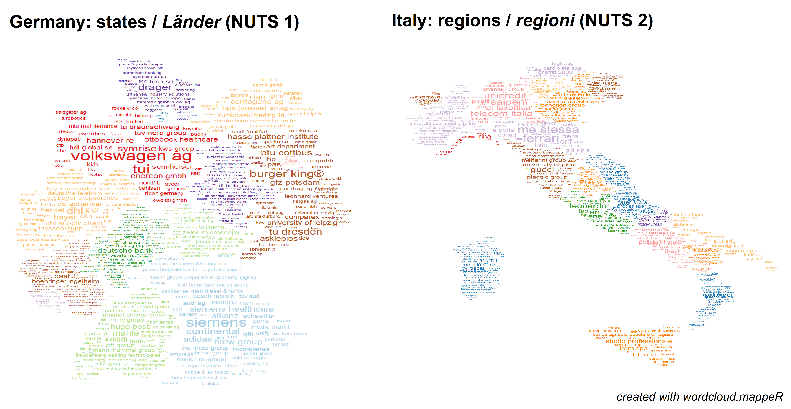
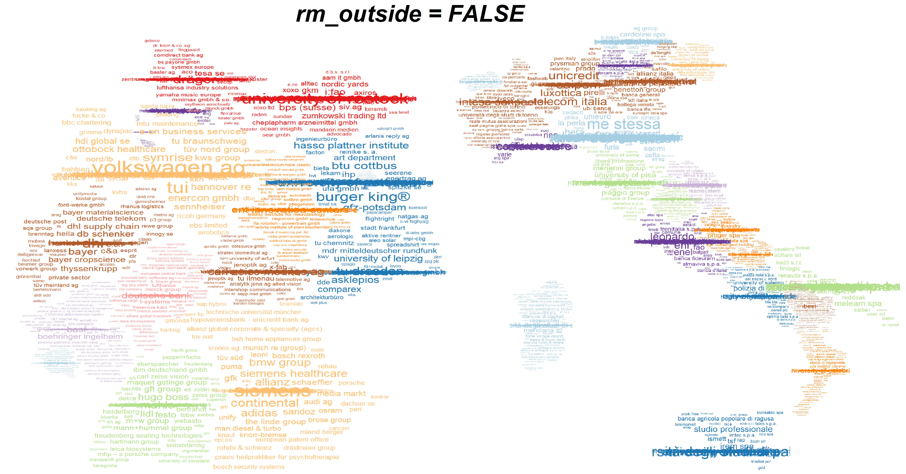
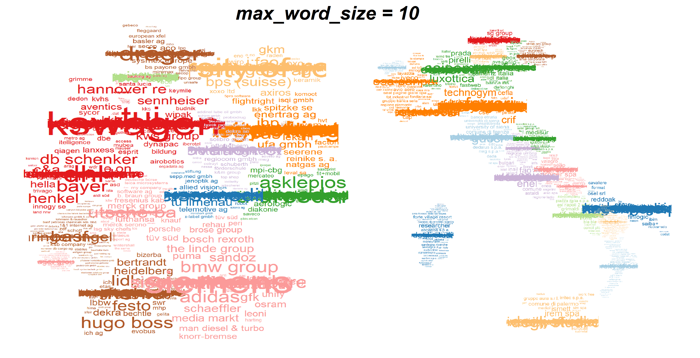
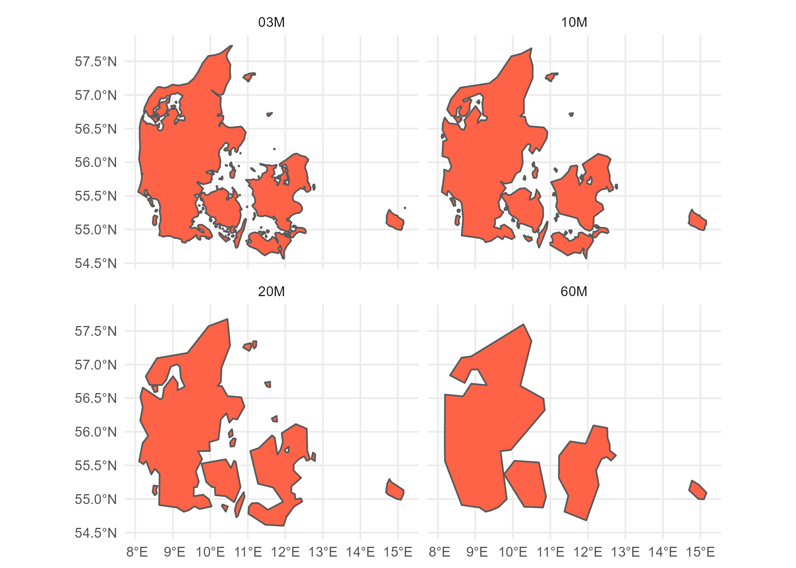

A package for creating wordcloud maps in R

```{r setup, include=FALSE}
knitr::opts_chunk$set(echo = TRUE)

library(devtools)
devtools::load_all()

input_data <- data.frame (words  = as.character(c(NA)),
                          frequencies = as.numeric(c(NA)),
                          nuts_codes = as.character(c(NA))
                          )

```

<br>


# Introduction to `wordcloud.mappeR`


`wordcloud.mappeR` is a package for R that allows one to **create wordclouds shaped like regions in a map**. Such visualisations are especially useful when communicating sets of data that consist of many different variables and each variable is attributed to a specific region and size of occurrence. Take the example below, a dataset containing the name of the 100 biggest companies (in terms of estimated number of employees) for each region in Germany and Italy.



<br>

The classification of regions used here follows the European Union's [Nomenclature of Territorial Units for Statistics (NUTS)](https://en.wikipedia.org/wiki/Nomenclature_of_Territorial_Units_for_Statistics), a geocode standard for referencing the subdivisions of countries. The advantage of using this system is that the classification of regions across countries is **standardised and hierarchically structured**. For instance, Germany has the base code *DE* (NUTS 0), the state of Bavaria has the code *DE2* (NUTS 1), its subregion of Oberbayern has the code *DE21* (NUTS 2) and the city of Munich has the code *DE212* (NUTS 3). Since each region is given a unique identifier which is directly linked to the regional level above it, it is fairly easy to identify and match any dataset to these regions.

However, this means that **this package currently only works for creating wordcloud maps for EU countries**. For an overview of the NUTS regions and levels, you can browse the available [maps for each EU country](https://ec.europa.eu/eurostat/web/nuts/nuts-maps) or use [this interactive map](https://ec.europa.eu/statistical-atlas/viewer/?config=typologies.json&) instead. If you have a dataset containing postcodes and want to convert these to NUTS regions, you can find the [correspondence tables here](https://ec.europa.eu/eurostat/web/nuts/correspondence-tables/postcodes-and-nuts).

<br>


# How to use `wordcloud.mappeR`


## Installing the package

Currently the package can only be installed through Github. We plan on publishing it to CRAN some time soon.

```{r eval=FALSE}
# install through Github
devtools::install_github("GabZech/wordcloud.mappeR")
# load the package
library(wordcloud.mappeR)
```

<br>


## The input data

### Format

The input data must be in the format of a table (i.e. data frame, tibble) containing three columns with the following data types:

1. A character column with **words** (e.g. the name of the companies)
2. A numeric column with **numbers** (e.g. the number of employees)
3. A character column with **NUTS region codes** (e.g. the states of a country)

Therefore, this is the minimal structure that the input data requires:

```{r echo=FALSE}
input_data
```

<br>


### Datasets included in the package

There are currently two datasets included in the package which we've obtained by transforming parts of the 2019 Global Company Dataset made freely available by People Data Labs [here](https://www.kaggle.com/peopledatalabssf/free-7-million-company-dataset). The original dataset contains an estimation of the number of employees in 2019 for over 7 million companies around the world. From this, we produced the following subsets:

- **`companies_DEU`** contains the 100 companies with the largest estimated number of employees for each state (NUTS 1) in Germany.
- **`companies_ITA`** containes the same type fo data but for the regions (NUTS 2) in Italy.

These can be loaded simply by using `data("name_of_dataset")` after loading the package to your R environment.

```{r}
data("companies_DEU")
companies_DEU
```

**Note:** some companies might be attributed to a wrong location in these datasets. This can happen because there were some mistakes and inconsistencies in the given location of each company in the original data. Nevertheless, these are supposed only to serve as example to produce working wordcloud maps, so we have not tried to identify and correct any of these possible misattributions. 

<br>


## Plotting with `wordcloud_map()`

### Arguments overview

The main function of the `wordcloud.mappeR` package is **`wordcloud_map()`**. This is the function that takes in the input data and plots the wordcloud map according to the parameters defined by the user. These are the arguments that the function requires and their specifications: 

```{r eval=FALSE}
wordcloud.mappeR::wordcloud_map(dataframe, 
                                country, 
                                level_nuts, 
                                name_column_words, 
                                name_column_frequency, 
                                name_column_nuts,
                                rm_outside = TRUE,
                                scale = "10",
                                png_path = "False")
```

<style>
div.highlight {background-color:#f3f0ff; border-radius: 5px; padding: 20px;}
</style>

<div class = "highlight">
Arguments | Data type | Description
:----|:----|:----------------------
`dataframe` | *dataframe* | The dataframe containing the input data.
`country` | *character* | The corresponding ISO 3 code of the country. See [wikipedia.org/wiki/ISO_3166-1_alpha-3](wikipedia.org/wiki/ISO_3166-1_alpha-3) for a list of all country codes.
`level_nuts` | *integer* | The NUTS level to which the NUTS codes correspond. Must be either `1`, `2` or `3`.
`name_column_words` | *character* | The name of the column in `dataframe` containing the words.
`name_column_frequency` | *character* | The name of the column in `dataframe` containing the frequencies.
`name_column_nuts` | *character* | The name of the column in `dataframe` containing the NUTS codes.
`max_word_size` | *numeric* | The maximum size of the words in the wordcloud. At the minimum value `1` all the words are equally sized. Default is `4`.
`rm_outside` | *logical* | Whether to remove words that could not be fitted in the wordcloud area. If set to `FALSE`, these words will be stacked on top of each other at the centre of each region. Default is `TRUE`.
`scale` | *character* | The desired scale of the regions to be used as the shape of the wordcloud. Must be either `"03"`, `"10"`, `"20"` or `"60"`. Default is `"10"`.
`png_path` | *character* | Path where the png image will be saved to, keeping the original aspect ratio of the country. Default is `"False"`.

</div>

<br>

For example, to reproduce the wordcloud maps shown at the top of this page, you can pass the following values to the `wordcloud_map()` function:

```{r eval=FALSE}

# Wordcloud map for Germany NUTS 1
wordcloud_map(companies_DEU, "DEU", 1, "name", "employees", "code")

# Wordcloud map for Italy NUTS 2
wordcloud_map(companies_ITA, "ITA", 2, "name", "employees", "code")

```

<br>


### The `rm_outside` argument

The `rm_outside` argument is one inherited from the [`ggwordcloud`](https://lepennec.github.io/ggwordcloud) package, which is used to generate the wordclouds here. It determines whether to **remove words that could not be fitted** in the given wordcloud area. When set to `FALSE`, it stacks all these words on top of each other at the centre of each region. For example, this is how the previous plots of Germany and Italy look like when `rm_outside = FALSE`:



**It is not always an issue** when words are not able to fit the wordcloud and are removed. The **order in which words are plotted is based`on descending frequency values** (i.e. the most frequent words are plotted first). So when datasets have too many words, the least important ones (i.e. the ones with lower frequencies) are the ones who will be removed when there is no more space to fit words in the given area.

Nevertheless, there are cases in which important words might be removed against your wish. So here a few reasons why some words will not be able to fit the wordcloud:

- **When the shape of a region is too narrow**. Words will not have enough space to fit when there is not enough available width.
- **When words are very long**. Such words require extra wide areas to fit the plot.
- **When there is not much variance in the frequencies of the most frequent words**. In that case, the first words will all try to be plotted with similar (large) sizes, meaning the available space will quickly run out and only smaller words will manage to fit.
- **When there are too many words in the dataframe**. Reducing the number of observations (i.e. rows) in the dataframe will help avoiding this.

A way to try to **fix** - or at least improve - this issue is by tweaking the argument `max_word_size` (see below). We recommend setting `rm_outside = FALSE` to see which words are not fitting and then decreasing the `max_word_size` until you are happy with the result.

<br>


### The `max_word_size` argument

The `max_word_size` argument defines the **maximum allowed size** for the words being plotted in the wordcloud. The minimum value is `1`, where all the words are equally sized, independent of their frequency values. The default value is `4`, but you might want to try to increase or decrease this value.

Increasing this number will make words with higher frequency values stand out more clearly from smaller ones. However, if these words are too big, they will not fit the wordcloud shape. This will make them either be plotted on top of other words (if `rm_outside = FALSE`) or be removed completely from the wordcloud (if `rm_outside = TRUE`).



<br>


### The `scale` argument

The `scale` argument refers to the scale used for the regions' polygon shapes. What matters here is whether a smaller or larger scale is selected, as they have inverse effects on the process and output:

- **Smaller** scales (e.g. `"03"`) mean **more detailed** polygon shapes.
  - Advantage: regions look more real (as the borders are more detailed).
  - Disadvantage: code takes longer to run (due to the larger shapefile being used for each region).
- **Larger** scales (e.g. `"60"`) mean **less detailed** and more "blocky-looking" shapes.
  - Advantage: code is quicker (due to the smaller shapefile being used for each region).
  - Disadvantage: regions look less real (as the borders are more simplified and "straight")
  
Here is an example of how the polygon shape of a region changes according to each different scale (credit [giscoR](https://cran.r-project.org/web/packages/giscoR/readme/README.html)):



